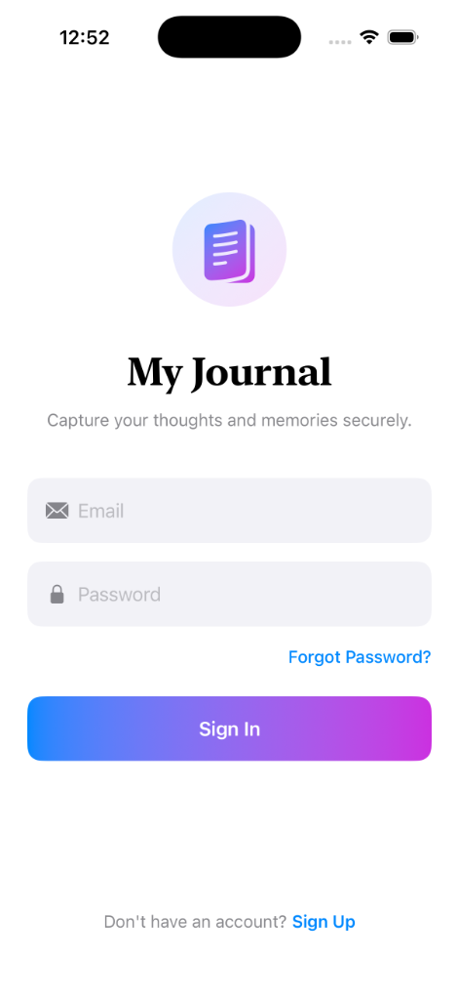
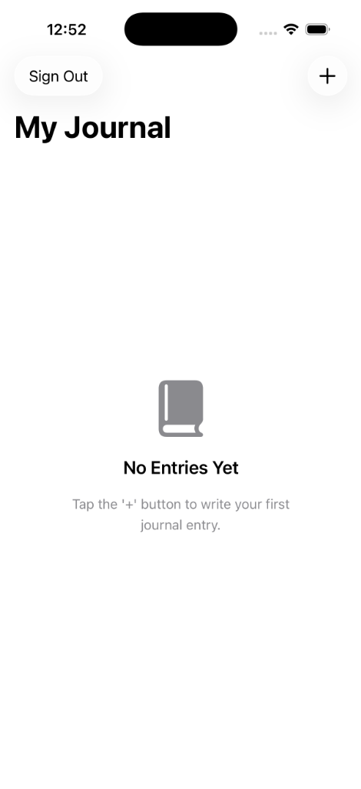
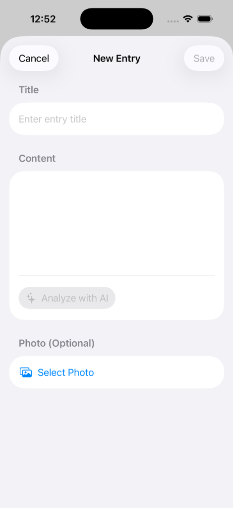
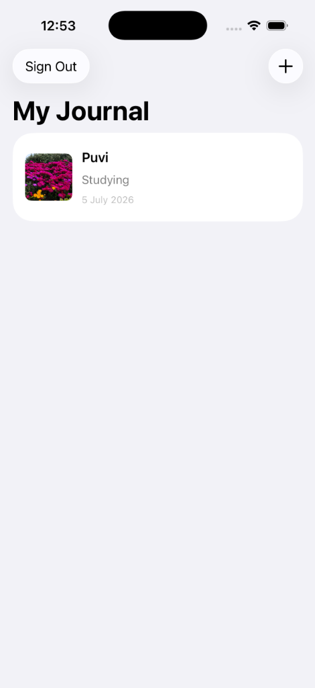
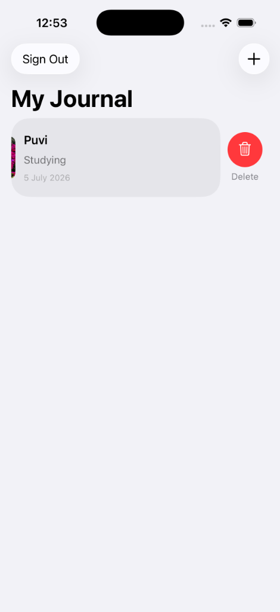

# 📓 My Journal

My Journal is a sleek, modern SwiftUI application designed to capture your thoughts, daily logs, and memories securely. Built on top of **Supabase**, it leverages modern cloud services for authentication, database storage, real-time sync, and media storage.

---

## 📱 Screenshots

| Login Screen | Empty Journal | New Entry | Journal List | Swipe to Delete |
|:---:|:---:|:---:|:---:|:---:|
|  |  |  |  |  |

---

## ✨ Features

- **🔐 Secure Authentication**: Fast login and sign-up powered by Supabase Auth with custom secure token storage bypassing keychain simulator limits.
- **🖼️ Rich Entries with Photos**: Capture media along with your thoughts. Photos are compressed and securely uploaded to Supabase Storage.
- **🔄 Real-time Synchronization**: Instant client-side updates using Supabase Realtime database streams.
- **🛠️ Modern SwiftUI Architecture**: Built using a robust Repository Pattern (`JournalRepository`), dependency separation, and modern reactive view updates.
- **🔒 Hidden Configuration Secrets**: Credentials and API keys are stored in local `.xcconfig` and `.env` configuration settings and ignored from version control to prevent credential leaks.

---

## 🛠️ Tech Stack & Dependencies

- **UI Framework**: SwiftUI (iOS 17.0+)
- **Backend / BaaS**: [Supabase](https://supabase.com)
- **SDK**: `supabase-swift` (v2.49.0)
- **Project Generation**: [XcodeGen](https://github.com/yonaskolb/XcodeGen)

---

## 🚀 Setup & Getting Started

### 1. Prerequisites
Ensure you have the following installed on your Mac:
* macOS 14.0+
* Xcode 15.0+
* [XcodeGen](https://github.com/yonaskolb/XcodeGen) (can be installed via Homebrew: `brew install xcodegen`)

### 2. Configure Configuration Files
Create a local configuration file named `Config.xcconfig` in the root of the project (this file is ignored in `.gitignore`):

```ini
// Helper variable to bypass the double-slash comment parsing gotcha in .xcconfig files
SLASH = /

SUPABASE_URL = https:$(SLASH)/YOUR_SUPABASE_PROJECT.supabase.co
SUPABASE_ANON_KEY = YOUR_SUPABASE_ANON_KEY
```

Also, create a `.env` file in the root for any local script/backend compatibility:
```env
SUPABASE_URL=https://YOUR_SUPABASE_PROJECT.supabase.co
SUPABASE_ANON_KEY=YOUR_SUPABASE_ANON_KEY
```

### 3. Generate the Xcode Project
Run `xcodegen` to construct the `.xcodeproj` file from `project.yml` and the local configurations:
```bash
xcodegen generate
```

### 4. Build and Run
Open `JournalApp.xcodeproj` in Xcode, select a simulator target (e.g. iPhone 17 Pro), and press **Cmd + R** to run!
