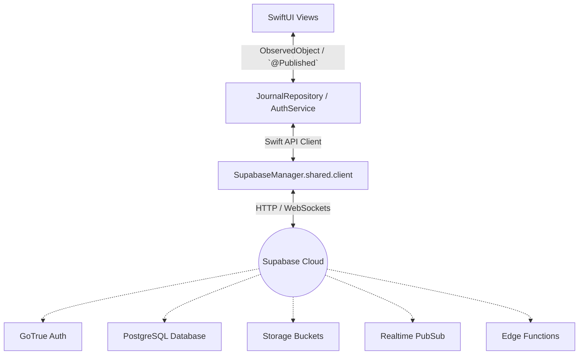

# Supabase & SwiftUI Integration Reference Guide

This guide explains how this Journal application integrates with Supabase, details the core concepts, and serves as a step-by-step checklist you can reuse to set up Supabase features in future SwiftUI projects.

---

## 1. Core Architecture

The application is structured into three layers:
1. **User Interface (SwiftUI):** Handles views, sheets, forms, input state bindings (`@State`), and observes repositories (`@StateObject`).
2. **Repository / Service (Swift):** Acts as the controller. It executes Supabase network calls asynchronously (`async/await`) and publishes updates on the `@MainActor` thread.
3. **Backend-as-a-Service (Supabase):** Manages user accounts (Auth), stores data in Postgres (Database), serves static files (Storage), executes serverless TypeScript code (Edge Functions), and broadcasts live changes (Realtime).



---

## 2. Supabase Core Concepts & Swift Implementations

### A. Authentication
* **How it works:** Supabase Auth utilizes a service called GoTrue. Authentication states are handled via JWT tokens.
* **Session Listener:** Instead of manually querying if a user is logged in, we subscribe to `authStateChanges` (a Swift asynchronous Stream). When a user signs in, signs out, or a token refreshes, the listener fires automatically.
* **Swift Implementation:**
  ```swift
  // Listening to Auth state changes in AuthService.swift
  self.authSubscription = Task {
      let stream = await SupabaseManager.shared.client.auth.authStateChanges
      for await (event, session) in stream {
          self.isAuthenticated = (session != nil)
      }
  }
  ```

### B. Database (PostgREST)
* **How it works:** Database operations utilize PostgREST, converting Swift method chains directly into PostgreSQL queries.
* **Date Parsing (Important):** PostgreSQL returns timestamps as ISO 8601 strings (e.g., `"2026-07-04T17:30:20Z"`). By default, Swift's `Codable` translates dates into numbers (seconds since 1970). To prevent parsing errors, you must override `init(from decoder:)` and `encode(to encoder:)` inside your data models to use `ISO8601DateFormatter`.
* **Swift Implementation:**
  ```swift
  // Fetching records in JournalRepository.swift
  let fetched: [JournalEntry] = try await SupabaseManager.shared.client
      .from("journal_entries")
      .select()
      .execute()
      .value
  ```

### C. Storage
* **How it works:** File storage stores images/documents. The bucket metadata is stored in `storage.buckets`, and files are stored in `storage.objects`.
* **RLS Policies (Crucial):** Merely creating a bucket is not enough. You must create database RLS policies on the `storage.objects` table. Without policies allowing `INSERT` (authenticated) and `SELECT` (public), file uploads will fail.
* **Swift Implementation:**
  ```swift
  // Uploading raw data to a bucket
  try await SupabaseManager.shared.client.storage
      .from("journal_photos")
      .upload("path/to/image.jpg", data: imageData)
  ```

### D. Serverless Edge Functions
* **How it works:** Supabase Edge Functions run TypeScript/Deno in a V8 runtime. They are ideal for secure operations (like hiding API keys, parsing content, or AI processing) that shouldn't happen client-side.
* **CORS Headers:** All Edge Functions called from browsers or mobile apps must handle preflight `OPTIONS` requests and attach Cross-Origin Resource Sharing (CORS) headers to allow incoming requests.
* **Swift Implementation:**
  ```swift
  let result = try await SupabaseManager.shared.client.functions.invoke(
      "analyze-sentiment",
      options: FunctionInvokeOptions(body: ["text": text]),
      decode: { data, _ in
          try JSONDecoder().decode(SentimentResponse.self, from: data)
      }
  )
  ```

### E. Realtime Broadcaster
* **How it works:** Listens to PostgreSQL Write-Ahead Logs (WAL). When a row is inserted, updated, or deleted, Supabase broadcasts that change over WebSockets.
* **Prerequisite:** The table must be added to the Supabase Realtime publication list (`supabase_realtime`).
* **Swift Implementation:**
  ```swift
  let channel = client.realtimeV2.channel("my_channel")
  let insertions = channel.postgresChange(InsertAction.self, schema: "public", table: "my_table")
  await channel.subscribe()
  
  Task {
      for await change in insertions {
          let newRecord = try change.decodeRecord(as: MyModel.self)
          // Update your UI array here
      }
  }
  ```

---

## 3. Checklist for Future Supabase Projects

Use this checklist whenever you start a new iOS app with Supabase:

### ⚙️ Step 1: Xcode & Dependencies Setup
* Add the **Supabase Swift SDK** package via Swift Package Manager (SPM):
  * Repository: `https://github.com/supabase-community/supabase-swift.git`
  * Add the targets: `Supabase` (which includes `Auth`, `PostgREST`, `Storage`, `Realtime`, and `Functions`).

### ⚙️ Step 2: Supabase Console Configuration
1. **Initialize Bucket:** Go to *Storage*, create a bucket, and configure **RLS policies** for `storage.objects`:
   * Allow `INSERT` for `authenticated` users.
   * Allow `SELECT` for `public` (if public files) or `authenticated` (if private).
2. **Realtime Tables:** Go to *Database > Replication*, click on **Source**, and add your tables to the `supabase_realtime` publication.
3. **Database Tables & RLS:** Enable RLS on all database tables and add appropriate select/insert/delete policies (e.g., `auth.uid() = user_id`).

### ⚙️ Step 3: Swift Setup
1. **Create the Singleton Manager:**
   ```swift
   import Supabase
   
   class SupabaseManager {
       static let shared = SupabaseManager()
       let client: SupabaseClient
       
       private init() {
           self.client = SupabaseClient(
               supabaseURL: URL(string: "https://your-url.supabase.co")!,
               supabaseKey: "your-anon-key"
           )
       }
   }
   ```
2. **Model Date Handling:** Ensure your Codable models map database timestamps securely:
   * Write custom `init(from decoder: Decoder)` to support timezone formats returned by the database.
   * Write custom `encode(to encoder: Encoder)` to format dates using `.withInternetDateTime` or `.withFractionalSeconds`.

---

## 4. Troubleshooting Reference

* **404 Error on Edge Function:** The function was not deployed to the cloud. Run `supabase functions deploy [function-name]` in your CLI.
* **Storage Upload Failed / Access Denied:** You are missing insert policies on the `storage.objects` table, or the user is not authenticated.
* **Realtime Changes Not Appearing:**
  * Ensure replication is turned on for that table under *Database > Replication*.
  * Check that `await channel.subscribe()` is called on startup.
  * Verify that you are listening to `InsertAction`, `UpdateAction`, or `DeleteAction` correctly.
